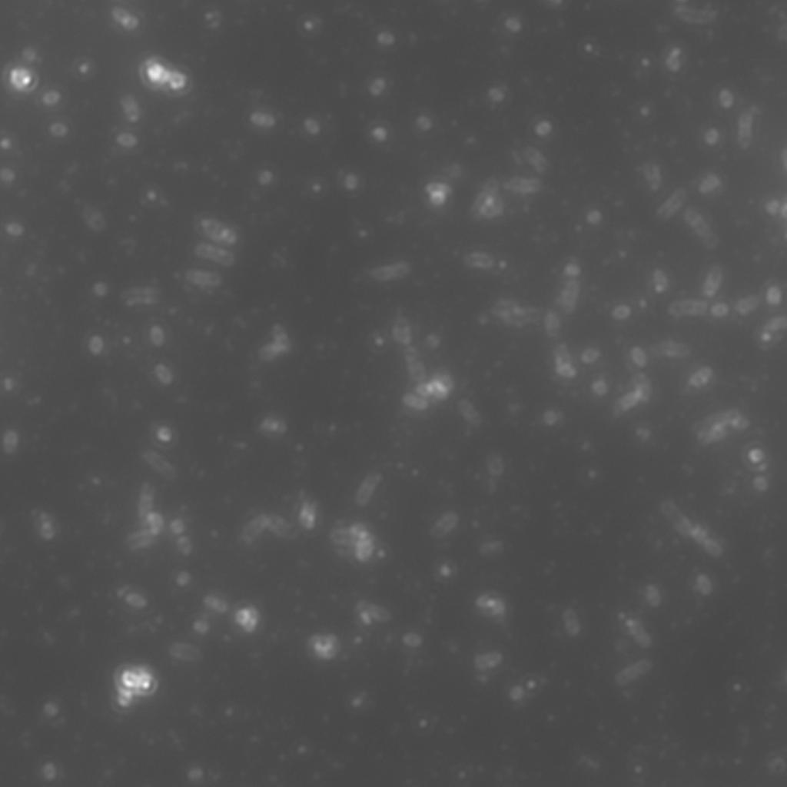
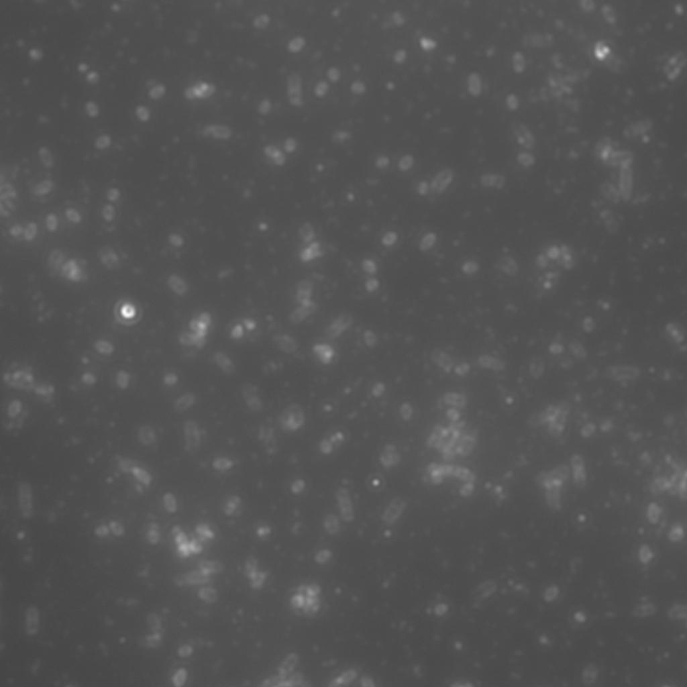
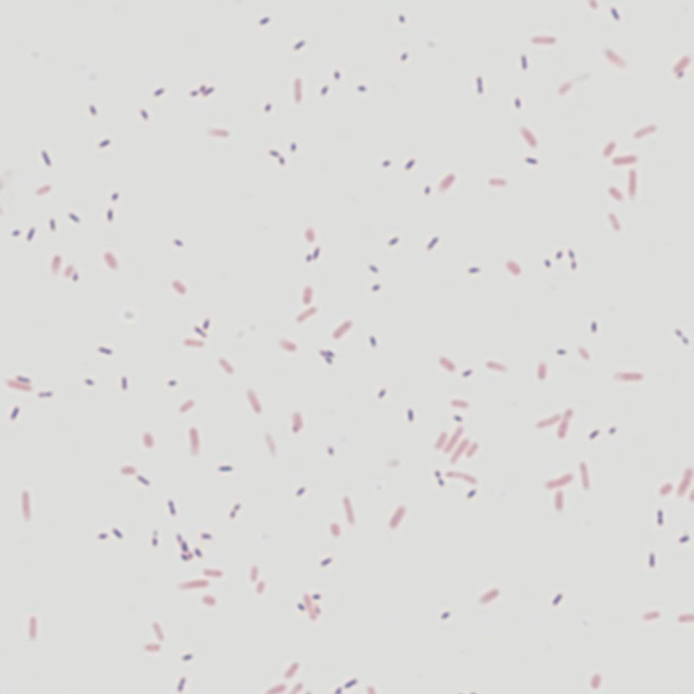
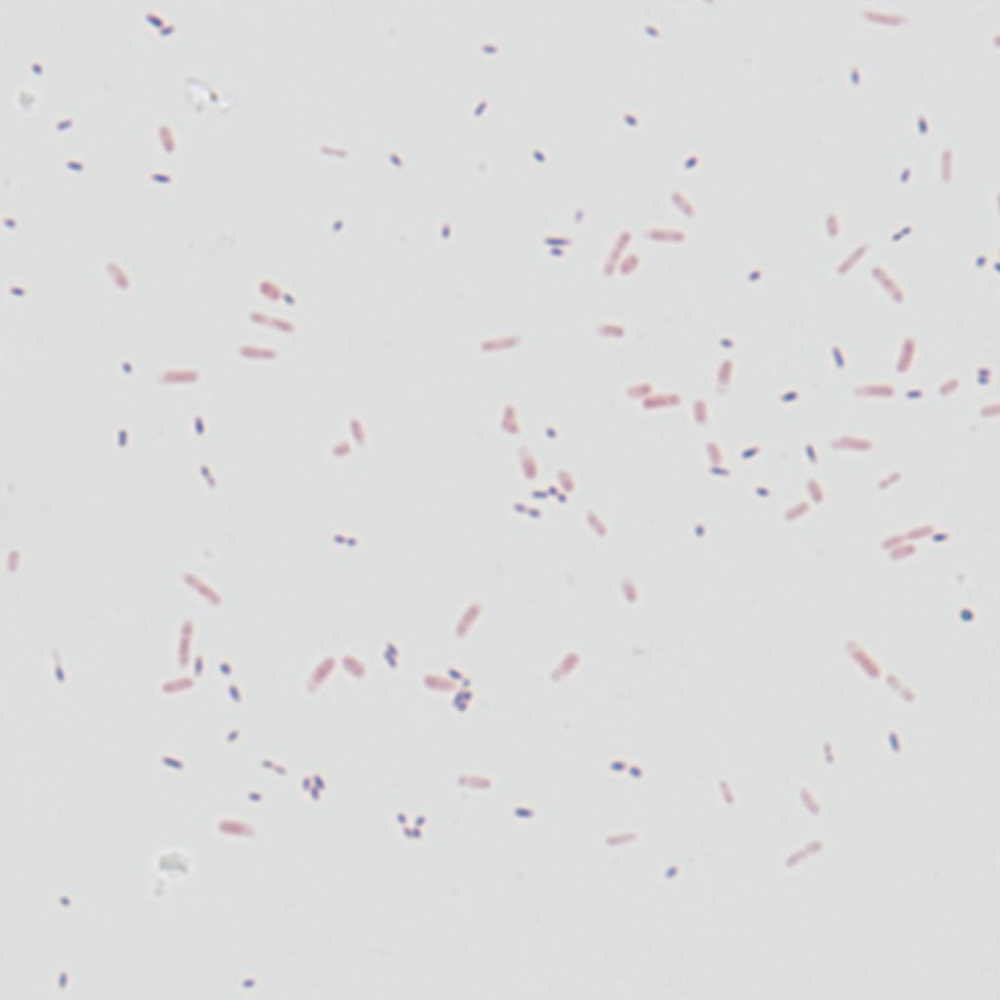
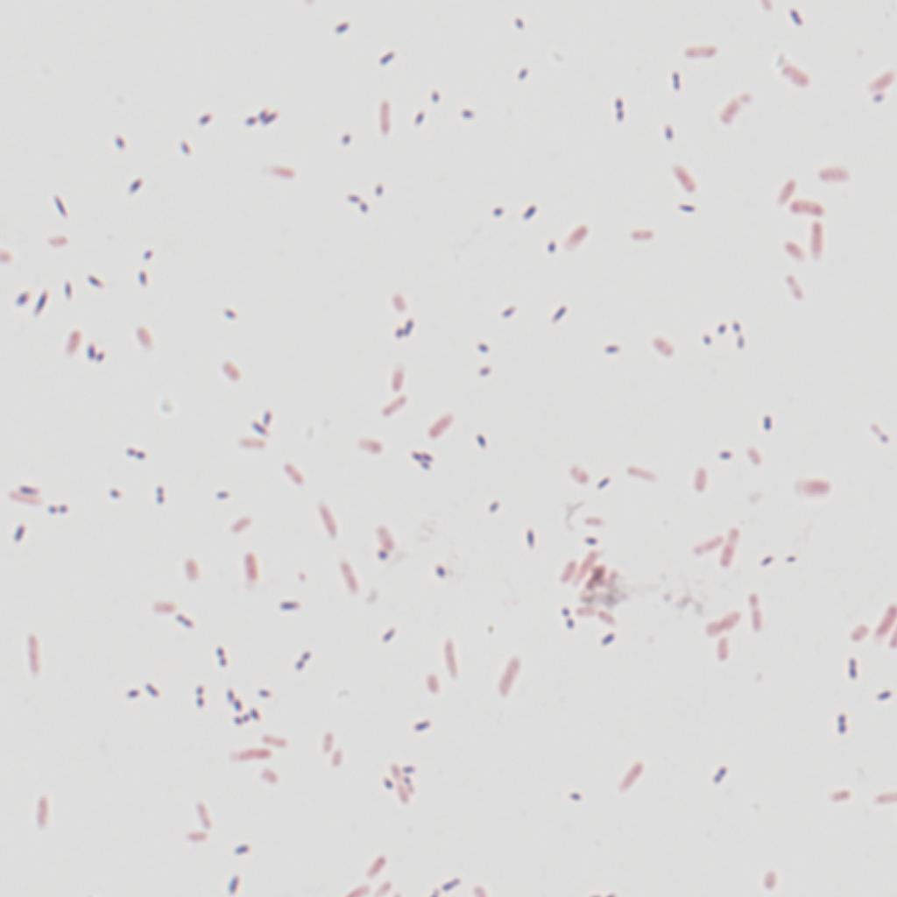

# Virtual Gram staining of bacteria using GANs
 Test code to run the trained virtual Gram staining model

This repository contains the test code and trained checkpoints of [Virtual Gram staining of label-free bacteria using darkfield microscopy and deep learning](https://arxiv.org/abs/2407.12337).

A Conditional GAN was trained to perform virtual Gram staining of label-free bacteria.

  

    <strong>Input images</strong> 
    
    
    <!-- Add more input images as needed -->
  

  

    <strong>Output images</strong> 
    
    

  

  

    <strong>Target images</strong> 
    
    

  

## How to start
* Download test data and checkpoints from this [link](https://drive.google.com/drive/folders/1f9eNcxyflmZJ7G47pdd6KyEzRdBxuTiU?usp=drive_link).
* Move test_data and ckpts folders into the repository folder.
* Run test_npy.py file in your CPU or GPU.

## Requirements
* Tensorflow 2.10
* Python 3.9.17